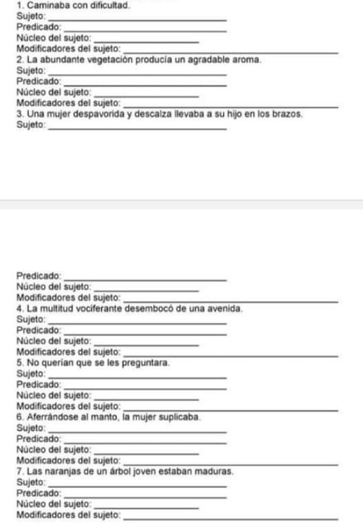
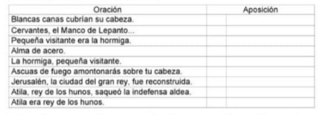
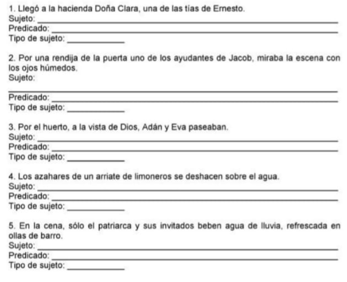
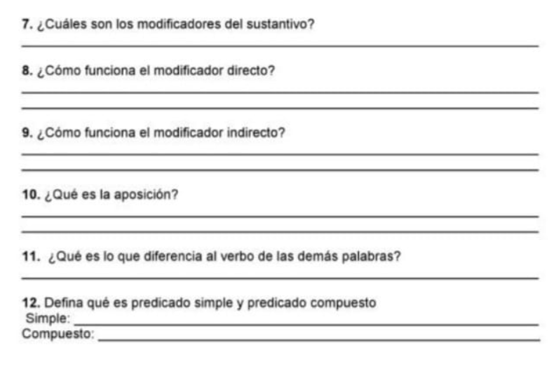

# Lista de tareas del modulo 2: Griego Koine

## Tarea 1

- [ ] Empleando las oraciones que siguen identifique y ponga por escrito cuál es el sujeto, el predicado y el núcleo del sujeto. Anote los modificadores del sujeto (si los hay) señalando si son adjetivos o artículos:

- [ ] En las oraciones que siguen identifique:

  - El sujeto
  - El núcleo del sujeto
  - El o los modificadores deirectos e indirectos

    1. La esperanza bienaventurada
    2. El sol del verano se reflejaba en el mar de Galilea
    3. Los cánticos del templo em hicieron evocar la presencia de Dios.
    4. La columna de nube guiaba al pueblo durante su travesía.
    5. Un cordero sin mancha.
    6. Con la frente en alto se enfrentó a su llamado.

- [ ] A continuacion hay varias oraciones. Marque con una `x` aquellas que presentan aposición y escriba cuál es ésta: 

## Tarea 2 - Ejercicios de repaso

- [ ] ¿Qué es la sintaxis?
- [ ] Defina qué es la oración
- [ ] ¿Qué es la oración unimembre?
- [ ] ¿Qué es la oración bimembre?
- [ ] Defina qué es sujeto y predicado:
- [ ] Identifique el sujeto y el predicado, señale con ua raya el núcleo del sujeto y diga si éste es simple o compuesto:  .

## Tarea 3

Falta la tarea de 4 paginas

## Tarea 4

Se olvidó de dejar tarea :3

## Tarea 5

- [ ] Mencione 30 palabras que lleven el acento (agudo, grave, y circunflejo) asi como el espiritu (suave y áspero o fuerte)
